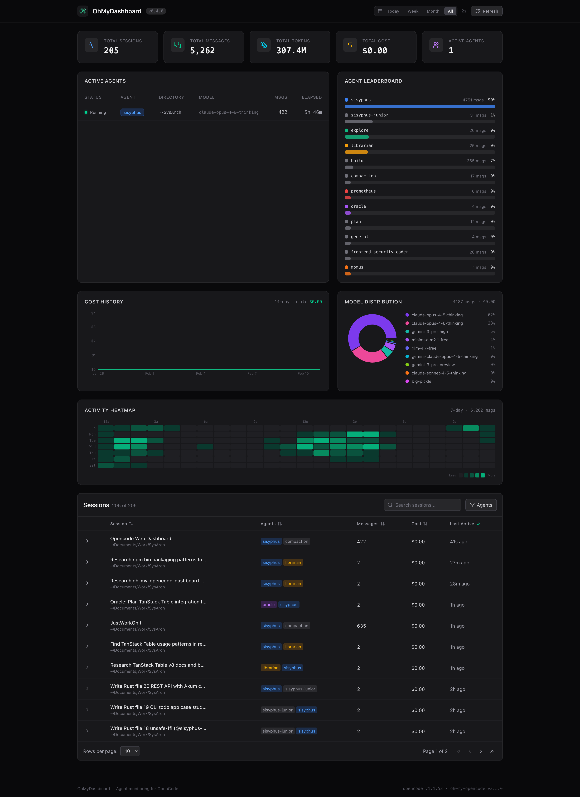

# OhMyDashboard

Agent monitoring dashboard for [OpenCode](https://opencode.ai) and [OhMyOpenCode](https://github.com/ohmyopencode).

See which agents are running, how many tokens you've burned, and what your sessions look like — all in one place.



## Quick Start

```bash
bunx @radenadri/ohmydashboard@latest
```

Opens at [http://127.0.0.1:51234](http://127.0.0.1:51234). That's it.

## Installing your fork (oh-my-opencode users)

If you maintain your own fork, you can run it directly from GitHub without publishing to npm:

```bash
bunx github:<your-user>/<your-fork>
```

Examples:

```bash
bunx github:felip/ohmydashboard
bunx github:felip/ohmydashboard#main
```

If you prefer to clone and run locally:

```bash
git clone https://github.com/<your-user>/<your-fork>.git
cd <your-fork>
npm install
npm run build
bun bin/cli.ts
```

### Make it work with custom OpenCode/oh-my-opencode storage

If your setup stores sessions in a non-default folder, set one of these env vars before running:

```bash
OPENCODE_STORAGE_PATH=/custom/path/to/opencode/storage
# or
OPENCODE_STORAGE=/custom/path/to/opencode/storage
```

PowerShell (Windows):

```powershell
$env:OPENCODE_STORAGE_PATH = "C:\\path\\to\\opencode\\storage"
bunx github:<your-user>/<your-fork>
```

CMD (Windows):

```cmd
set OPENCODE_STORAGE_PATH=C:\path\to\opencode\storage
bunx github:<your-user>/<your-fork>
```

The CLI now prints the detected storage path at startup so you can confirm it's reading the right location.

### Options

```bash
bunx @radenadri/ohmydashboard --port 8080       # custom port
bunx @radenadri/ohmydashboard --host 0.0.0.0    # expose to network
```

## Features

- **5 Summary Cards** — Total sessions, messages, tokens, cost, and active agents at a glance
- **Active Agents** — Live view of running agents with model, directory, message count, and elapsed time
- **Agent Leaderboard** — Who's doing all the work (ranked by message count)
- **Cost History** — 14-day area chart of estimated costs
- **Model Distribution** — Donut chart showing which models get the most use
- **Activity Heatmap** — GitHub-style 7-day heatmap (hour x day-of-week)
- **Session Table** — Full session list with TanStack Table: sorting, search, agent filter, pagination, expandable rows
- **Date Filtering** — Today / Week / Month / All toggle
- **Auto-refresh** — Dashboard updates every 15 seconds
- **Dark Mode** — Because obviously

## How It Works

OhMyDashboard reads OpenCode's local JSON storage directly. By default it auto-detects:

```
~/.local/share/opencode/storage/
├── session/      # Session metadata
├── message/      # Message content
├── part/         # Message parts (tool calls, results)
└── project/      # Project registry
```

On Windows, it also checks:

```
%LOCALAPPDATA%\opencode\storage
%USERPROFILE%\.local\share\opencode\storage
```

If your fork/plugin stores data elsewhere, set one of these env vars before starting:

```bash
OPENCODE_STORAGE_PATH=/custom/path/to/opencode/storage
# or
OPENCODE_STORAGE=/custom/path/to/opencode/storage
```

No database, no API keys, no configuration. If OpenCode runs on your machine, the dashboard just works.

If JSON session folders are missing but `opencode.db` exists, OhMyDashboard automatically falls back to SQLite and reads from:

```
~/.local/share/opencode/opencode.db (Windows: %USERPROFILE%\.local\share\opencode\opencode.db)
```

You can also override DB path:

```bash
OPENCODE_DB_PATH=/custom/path/to/opencode.db
```

## Development

```bash
git clone <repo>
cd ohmydashboard
npm install
npm run dev
```

This starts two processes:
- **Vite** dev server on `:5174` (frontend with HMR)
- **Hono** API server on `:3456` (backend)

### Build

```bash
npm run build    # TypeScript check + Vite build
```

### Production (local)

```bash
bun bin/cli.ts   # Single server on :51234
```

## Tech Stack

| Layer | Tech |
|-------|------|
| Frontend | React 19, Tailwind CSS v4, Recharts, TanStack Table, Lucide Icons |
| Backend | Hono (serves API + static SPA) |
| Runtime | Bun (CLI + server) |
| Build | Vite 7, TypeScript 5.9 |

## Project Structure

```
ohmydashboard/
├── bin/cli.ts                  # CLI entry (bunx ohmydashboard)
├── server/
│   ├── index.ts                # Hono app + dev server
│   ├── opencode-reader.ts      # Reads OpenCode JSON storage
│   └── cache.ts                # TTL cache (30s)
├── src/
│   ├── App.tsx                 # Dashboard layout
│   ├── components/
│   │   ├── Logo.tsx            # SVG logo
│   │   └── dashboard/          # All dashboard panels
│   ├── hooks/
│   │   └── useDashboardData.ts # Data fetching + auto-refresh
│   └── types/opencode.ts       # TypeScript interfaces
├── public/favicon.svg
└── package.json
```

## Requirements

- **Bun** >= 1.1.0
- **OpenCode** installed and used (needs an OpenCode `storage` directory to exist)

## Quick Diagnostics (if `bunx` fails)

If you see module resolution errors (example: `Cannot find module '@hono/node-server'`), run:

```bash
# inspect what would be published
npm pack --dry-run

# verify runtime dependency classification
npm run verify:runtime-imports

# verify packed artifacts contain CLI + runtime server files
npm run verify:pack

# full end-to-end local tarball smoke test
npm run verify:smoke
```

Expected smoke-test behavior:
- Local tarball installs to temp directory
- CLI boots successfully
- `GET /api/stats` returns `200`
- `/` (dashboard UI) returns `200`

## Safe Release Checklist

Before `npm publish`, run:

```bash
npm run release:verify
```

This executes, in order:
1. Runtime import audit (`verify:runtime-imports`)
2. Full build (`npm run build`)
3. Pack integrity check (`verify:pack`)
4. Local tarball smoke test (`verify:smoke`)

If any step fails, publish is blocked by `prepublishOnly`.

## License

MIT
